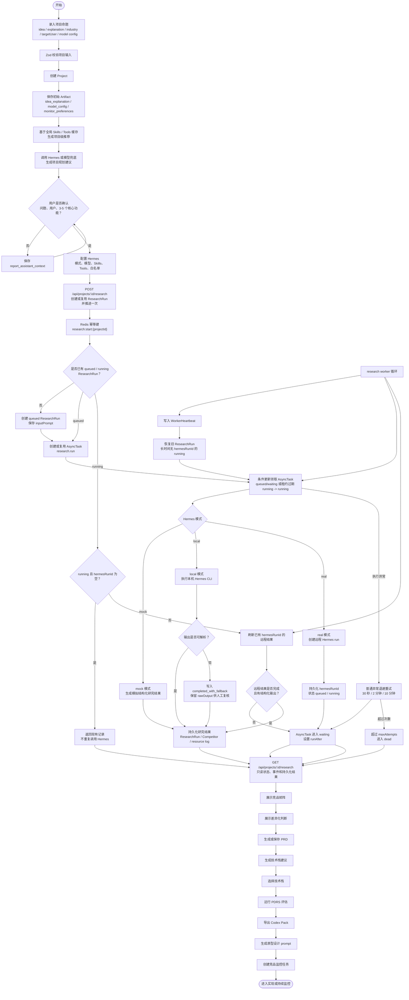

# SpecFlow Agent 架构图与系统流程图

本文档描述当前代码实现下的系统结构和端到端业务流程。图中 `GET /api/projects/:id/research` 被定义为只读状态接口；任务推进由 `POST /api/projects/:id/research` 或 research worker 执行。

## 系统架构图

```mermaid
flowchart TB
  User["用户 / 产品负责人"]
  Browser["浏览器\nNext.js App Router 页面"]

  subgraph Frontend["前端界面层"]
    Home["首页 / 项目列表"]
    Intake["新建项目表单"]
    Workspace["项目工作台"]
    HermesPanel["Hermes 快速配置与资源管理"]
    StatusPanel["ResearchRun 状态面板"]
    ExportUI["Codex Pack / PPT / Prompt 导出界面"]
    OpsUI["/ops 运维页面"]
  end

  subgraph Web["Next.js 服务端层"]
    ServerActions["Server Actions\ncreateProject / save / evaluate / export"]
    ApiRoutes["API Routes\nprojects / research / hermes / export"]
    ProjectFlow["project-flow 服务层\n编排项目主流程"]
    AsyncTaskStore["AsyncTask store\n领取 / 重试 / 租约恢复"]
    CacheClient["Redis cache client\n缓存 / 限流 / 幂等 / pub-sub"]
    Observability["Observability\nlog / metric / span / model cost"]
    ArtifactStore["Artifact Storage\nDB inline / local file"]
    HermesClient["Hermes Adapter\nmock / local / real"]
    ModelClient["Model Client\nDeepSeek / DashScope / OpenAI-compatible"]
    SkillConfig["Skills / Tools 配置与推荐\nresource-config / project-recommendations"]
  end

  subgraph Worker["后台任务层"]
    ResearchWorker["research worker\n领取 AsyncTask / 刷新 Hermes / 心跳"]
  end

  subgraph Persistence["持久化层"]
    Postgres[("PostgreSQL")]
    Prisma["Prisma Client"]
    Project["Project"]
    ResearchRun["ResearchRun"]
    Competitor["Competitor"]
    Evaluation["Evaluation"]
    Artifact["GeneratedArtifact"]
    StoredArtifact["StoredArtifact"]
    AsyncTask["AsyncTask / AsyncTaskAttempt / WorkerHeartbeat"]
    OpsTables["OperationalEvent / MetricSample / TraceSpan / ModelInvocation"]
    MonitorJob["MonitorJob / MonitorReport"]
  end

  subgraph Coordination["缓存与协调层"]
    Redis[("Redis\n非事实源")]
  end

  subgraph HermesRuntime["Hermes 执行层"]
    RealHermes["Real Hermes HTTP API"]
    LocalHermes["Local Hermes CLI\npython -m hermes_cli.main"]
    MockHermes["Mock Hermes\n测试与演示"]
    HermesDashboard["Local Dashboard\nstart / stop / restart"]
  end

  subgraph LocalState["本机状态文件"]
    Env[".env"]
    ModelConfig[".next/hermes/model-config.json"]
    DashboardPid[".next/hermes/dashboard.pid"]
    SkillWhitelist["HERMES_LOCAL_ROOT/skills/safety-whitelist.json"]
    SkillCache[".cache/hermes/skills-inventory-cache"]
    ArtifactDir[".data/artifacts"]
  end

  User --> Browser
  Browser --> Home
  Browser --> Intake
  Browser --> Workspace
  Workspace --> HermesPanel
  Workspace --> StatusPanel
  Workspace --> ExportUI
  Browser --> OpsUI

  Intake --> ServerActions
  Workspace --> ServerActions
  Workspace --> ApiRoutes
  HermesPanel --> ApiRoutes
  StatusPanel --> ApiRoutes
  ExportUI --> ApiRoutes

  ServerActions --> ProjectFlow
  ApiRoutes --> ProjectFlow
  ApiRoutes --> CacheClient
  ApiRoutes --> ArtifactStore
  ApiRoutes --> Observability
  ProjectFlow --> HermesClient
  ProjectFlow --> ModelClient
  ProjectFlow --> SkillConfig
  ProjectFlow --> AsyncTaskStore
  ProjectFlow --> ArtifactStore
  ProjectFlow --> Observability
  ProjectFlow --> CacheClient
  ResearchWorker --> AsyncTaskStore
  ResearchWorker --> ProjectFlow
  ResearchWorker --> Observability

  ProjectFlow --> Prisma
  AsyncTaskStore --> Prisma
  ArtifactStore --> Prisma
  Observability --> Prisma
  ApiRoutes --> Prisma
  CacheClient --> Redis
  AsyncTaskStore --> Redis
  Prisma --> Postgres
  Postgres --> Project
  Postgres --> ResearchRun
  Postgres --> Competitor
  Postgres --> Evaluation
  Postgres --> Artifact
  Postgres --> StoredArtifact
  Postgres --> AsyncTask
  Postgres --> OpsTables
  Postgres --> MonitorJob

  HermesClient --> RealHermes
  HermesClient --> LocalHermes
  HermesClient --> MockHermes
  ApiRoutes --> HermesDashboard

  Env --> HermesClient
  Env --> ModelClient
  ModelConfig --> HermesClient
  DashboardPid --> HermesDashboard
  SkillWhitelist --> SkillConfig
  SkillCache --> SkillConfig
  ArtifactStore --> ArtifactDir
```

## 整体系统流程图

## 关键边界

- 状态读取：`GET /api/projects/:id/research` 只读，不领取队列，不启动 Hermes。
- 任务推进：`POST /api/projects/:id/research` 推进一次；research worker 负责长期领取、刷新、重试和恢复。
- 并发控制：`AsyncTask` 使用条件更新和 `lockedBy + lockExpiresAt` 租约；`running && hermesRunId=null` 的 `ResearchRun` 不重复执行。
- Redis 边界：Redis 只用于缓存、限流、短期幂等键和 worker 唤醒信号，不保存核心任务状态。
- 可观测性：worker 生命周期、Hermes 调用、模型调用、Artifact 写入/下载/删除均写入 PostgreSQL 可观测性表，并由 `/ops` 展示。
- 产物存储：小文本可内联到数据库，大文件写入 `.data/artifacts`；数据库保存 metadata、checksum、版本和下载信息。
- 审计数据：原始 Hermes output、解析结果、竞品矩阵、资源使用日志和导出产物 metadata 均写入数据库。
- 本地配置：模型配置保存在 `.next/hermes/model-config.json`；保存配置不扫描或启动 dashboard。
